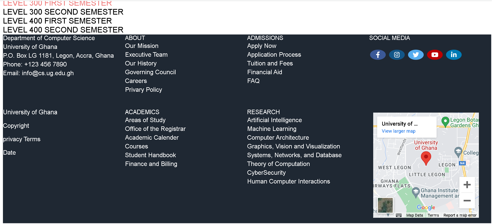

# DCIT 205 IA

## Department of Computer Science Website

Welcome to the README for website of Department of Computer Science of University of Ghana

## Introduction

Department of Computer Science of University of Ghana's website provides comprehensive information about the undergraduate programs offered by the Department of Computer Science. This includes details about academic courses, degree requirements, faculty profiles, and various resources aimed at supporting students throughout their academic journey.The DCS UG website is designed for:
1. Prospective Students
2. Current Students
3. Faculty and Staff
4. General Public

## Key Features
### Academic Programs
Detailed information about the Computer Science undergraduate programs, including curriculum, specializations, and degree requirements.

### Faculty Profiles:
Profiles of esteemed faculty members, showcasing their expertise, research interests, and contributions to the field.

### Student Resources
 Resources and support services available to undergraduate students, such as advising, career guidance, and extracurricular opportunities.


 ### News and Events
 Stay updated on the latest news, events, and achievements within the Department of Computer Science.


## Instructions to Clone and Set Up the Project

To get started with Department of Coputer Science's website, follow these steps:


1. **Create a folder on your PC**

2. **Open the folder in terminal/cmd**

3. **Clone the Repository:**
    ```bash
    git clone https://github.com/KwesiKing/11227686_DCIT_205.git
    ```

4. **Open the clone folder in an IDE**
    ```bash
    code .
    ```

5. **Work on the files in the IDE**
   

4. **Open with Live Server to view current changes**


## Your Information

- **Name:** Amoako Albert Nana Kwesi
- **Student ID:** 11227686

## Screenshots

### Home Page


### About Page


### Contact Us Page


### Courses Page





### Events Page


### Faculty Page


### FAQ Page


### Graduate Admission Page


### Overview Page


### Research Page


## Project Learnings

Throughout the development of website of Department of Computer Science of the University of Ghana, I have gained valuable insights and skills, including:

- **HTML:** Developed a structured and semantic layout for the website, ensuring accessibility and readability.

- **CSS:** Applied styles and layouts to enhance the visual appeal of the website, including responsive design for various screen sizes.

- **JavaScript:** Implemented small but impactful interactive features using JavaScript to enhance user experience.

This project allowed me to focus on the fundamentals of web development, honing my skills in front-end technologies. While the project scope was centered around HTML, CSS, and small JavaScript functionalities, the experience has laid a solid foundation for future projects and further exploration into the world of web development.


## Acknowledgments

I would like to express my gratitude to Dr. Sorli and Daquiver

## Conclusion

Thank you for exploring Department of Computer Science's website. If you have any questions or feedback, feel free to reach out. 
- My email: info.me.albert@gmail.com
- My phone: +233 20 192 9434


